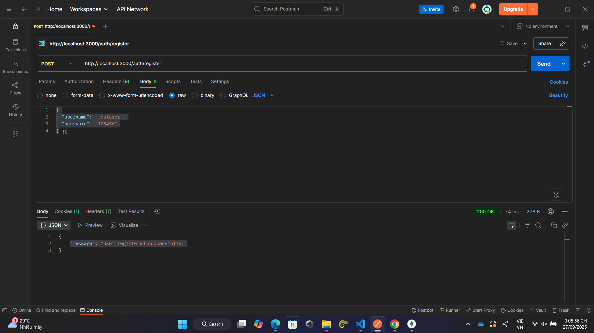
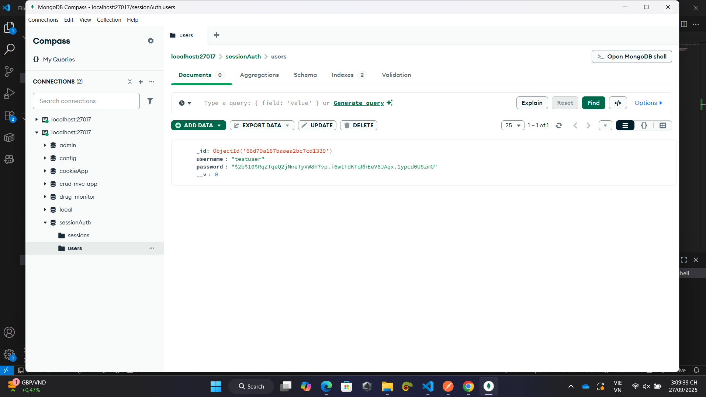
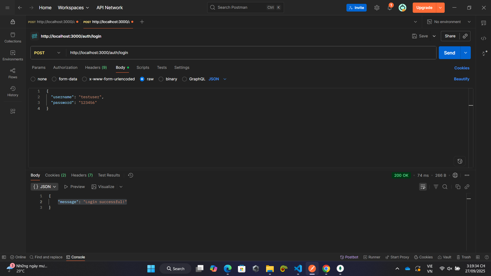
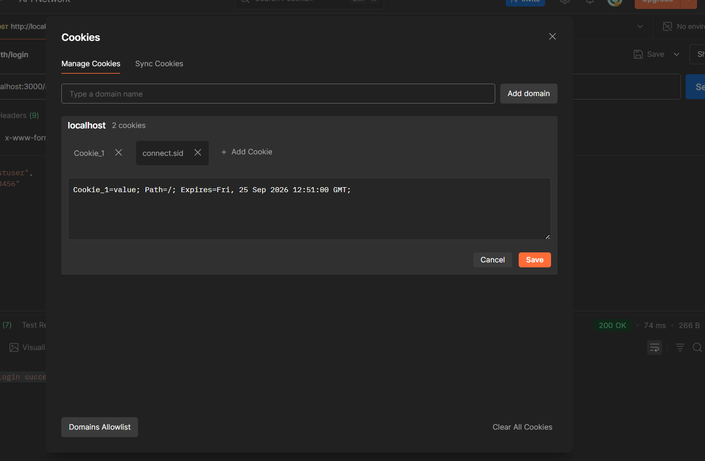
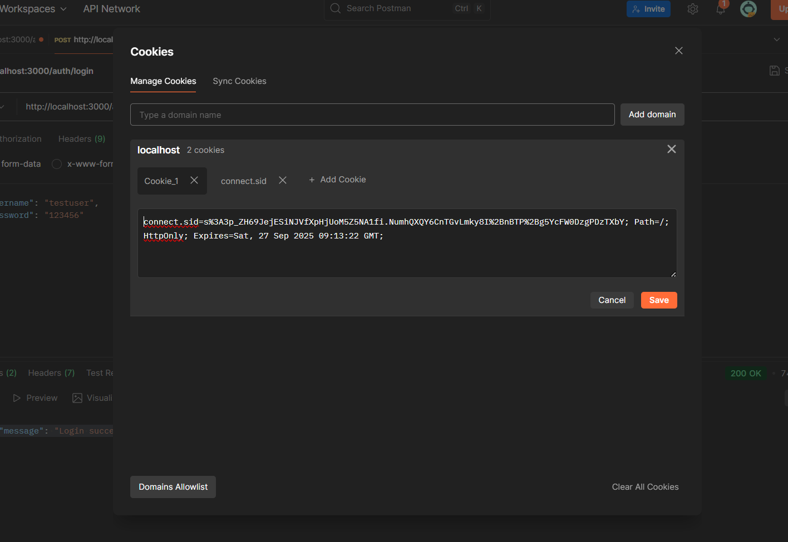
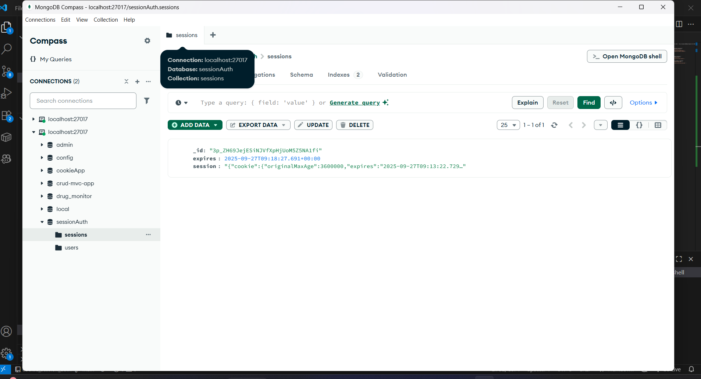
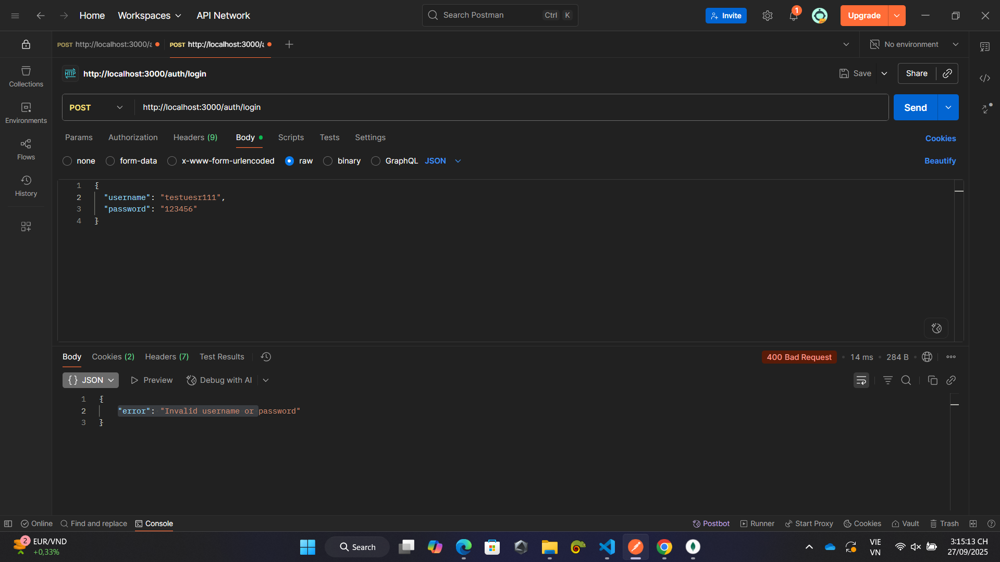
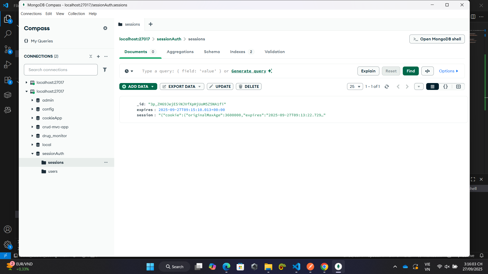

1. Chạy file app.js: node app.js

2. Đăng ký tài khoảng với route "/register" với phương thức POST và http://localhost:3000/auth/register tại POSTMAN
- Nhập username và password: 
{
  "username": "testuser",
  "password": "123456"
}
sau đó nhấn Send. kết quả trả về là "message": "User registered successfully!"

- Tài khoản mới được lưu trong database

3. Login (Đăng nhập)

Method: POST
URL: http://localhost:3000/auth/login

-TH: Đăng nhập thành công, hiện thông báo ""message": "Login successful!""

-Cookie trong postman

-Session được lưu trong database

-TH Đăng nhập thấy bại, hiện thông báo ""error": "Invalid username or password""

- Không lưu trong database

