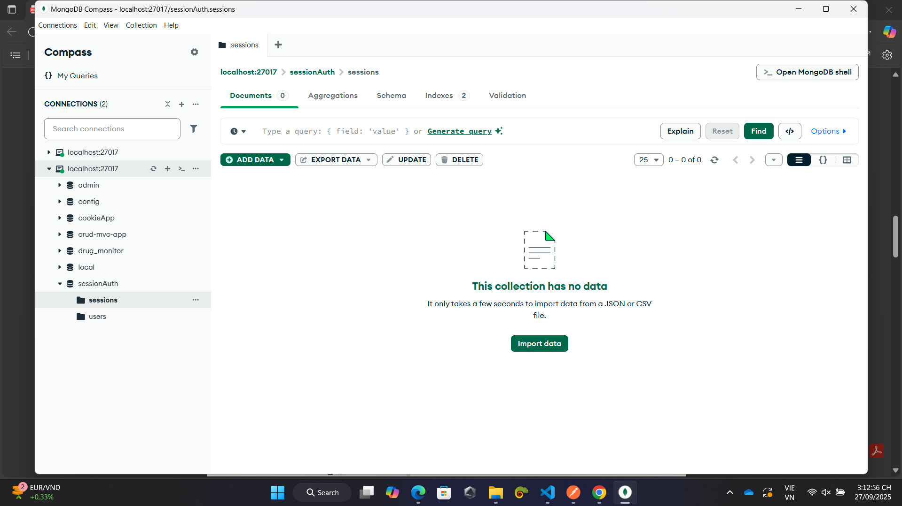
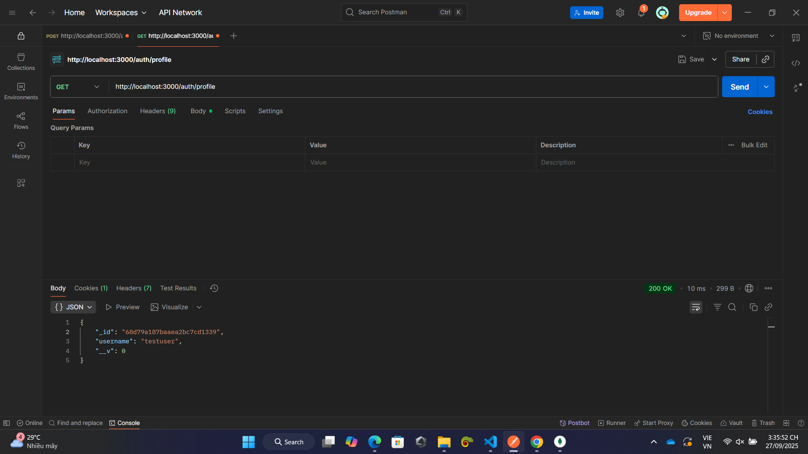
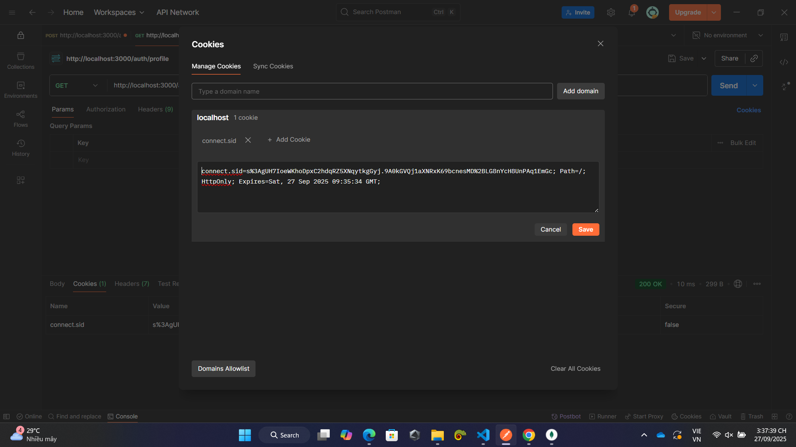
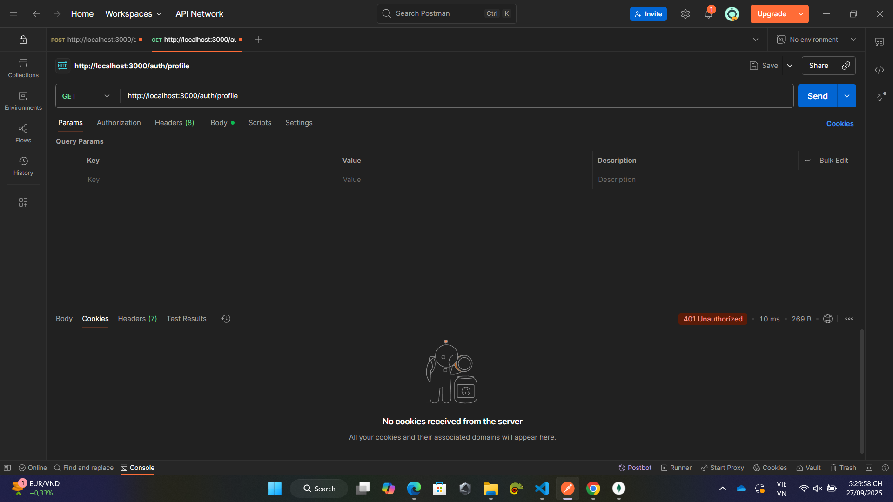
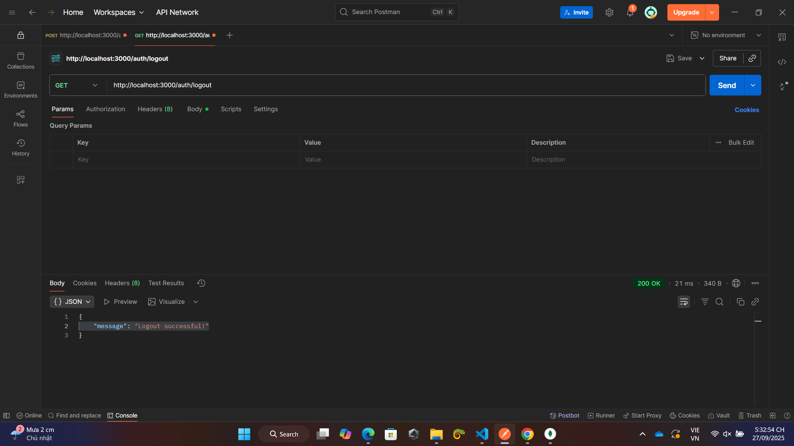
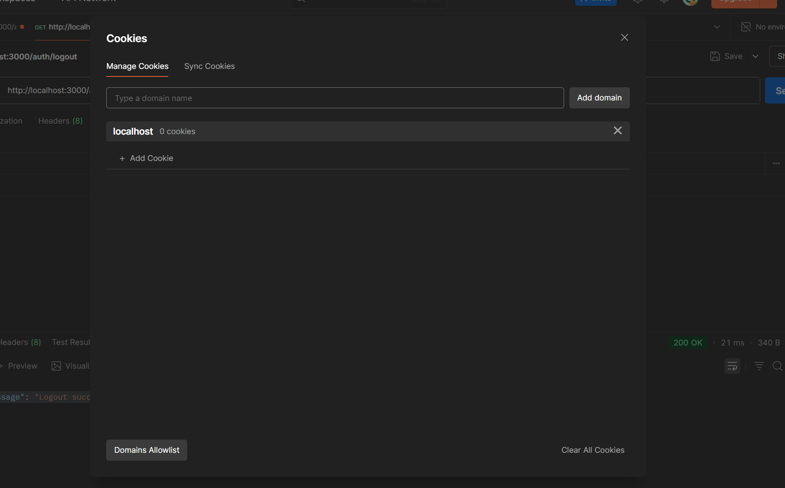
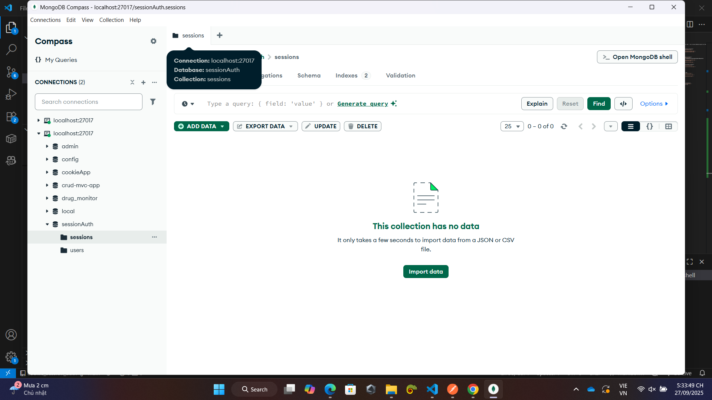

1. Chạy file app.js: node app.js

2. Đăng ký tài khoảng với route "/register" với phương thức POST và http://localhost:3000/auth/register tại POSTMAN
- Nhập username và password: 
{
  "username": "testuser",
  "password": "123456"
}
sau đó nhấn Send. kết quả trả về là "message": "User registered successfully!"

- Tài khoản mới được lưu trong database

3. Login (Đăng nhập)

Method: POST
URL: http://localhost:3000/auth/login

-TH: Đăng nhập thành công, hiện thông báo ""message": "Login successful!""

- cookie có giá trị: s%3A3p_ZH69JejESiNJVfXpHjUoM5Z5NA1fi.NumhQXQY6CnTGvLmky8I%2BnBTP%2Bg5YcFW0DzgPDzTXbY
-Cookie trong postman

-Session được lưu trong database

-TH Đăng nhập thất bại, hiện thông báo ""error": "Invalid username or password""

- Không lưu trong database

4. Profile (Xem thông tin cá nhân)

Method: GET

URL: http://localhost:3000/auth/profile

- Xem thông tin thành công, hiển thị thông báo tên người dùng

- Có giá trị cookie bằng giá trị cookie khi đăng nhập

-Khi cookie hết hạn thì không xem được nữa (hạn 1 giờ)

5. Logout (Đăng xuất)

Method: GET

URL: http://localhost:3000/auth/logout

-Logout thành công hiện thông báo "    "message": "Logout successful!""

-Cookie trong postman cũng bị xóa và trong database cũng bị xóa

